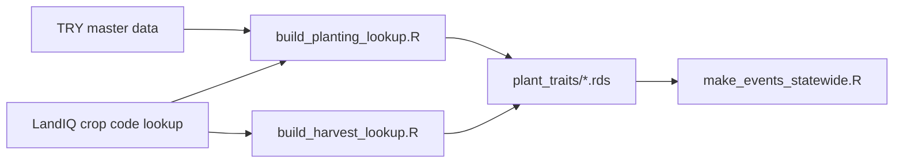

# Planting and harvest trait lookups

One-time builders for the tables that set **carbon/nitrogen pools at planting**
and **harvest removal fractions**. Statewide event generation
([events/README.md](../events/README.md)) loads these via
`pool_calculations_from_lookup.R`.

Why: SIPNET needs initial biomass pools and harvest fractions per crop; those
come from trait lookups (TRY + LandIQ), not from satellite dates alone.



Pipeline: after [phenology/match](../phenology/match/README.md), before the Session 2
event run. Walkthrough: [Session 2](../documentation/sessions/02-phenology.md).

Fallback order for traits: **subclass -> class -> PFT -> global**.

## Prerequisites

```bash
source "$CCMMF_CODE/documentation/setup_env.sh"
```

| Input | Path / env |
|-------|------------|
| LandIQ crop code lookup | `$CCMMF_MANAGEMENT/LandIQ_cropCode_lookup_table.csv` (copy from [landiq-gapfill/data](../landiq-gapfill/data/LandIQ_cropCode_lookup_table.csv) if missing) |
| TRY master data (planting only) | `TRY_MASTER_DATA` (path to `master_data.RData`) |

Required packages: `dplyr`, `readr`, `tibble`, `tidyr`, `data.table`.

## Build lookups (once)

Training uses the **placeholder** harvest table. Skip this step if
`$CCMMF_MANAGEMENT/plant_traits/planting_lookup_long.rds` and
`harvest_lookup_long.rds` already exist.

```bash
Rscript $CCMMF_CODE/traits/build_planting_lookup.R
Rscript $CCMMF_CODE/traits/build_harvest_lookup.R
```

Outputs under `$CCMMF_MANAGEMENT/plant_traits/`:

| File | Role |
|------|------|
| `planting_lookup_long.rds` / `.csv` | Trait stats at subclass / class / PFT / global |
| `harvest_lookup_long.rds` / `.csv` | Harvest removal fractions (placeholder means by PFT) |

Woody classes (V/D/C) stay on woody placeholders (`0.15` / `0.015`) until standing
AGB exists for a real yield/biomass calc.

## How events use these

`make_events_statewide.R` sources `pool_calculations_from_lookup.R` and calls:

- `initialize_planting(...)` with matched MSLSP `EVImax` / `EVIamp` (or a fixed LAI)
- `initialize_harvest_from_lookup(...)` for removal fractions

Ad-hoc check:

```r
source(file.path(Sys.getenv("CCMMF_CODE"), "traits/pool_calculations_from_lookup.R"))
lk <- load_trait_lookup()
p <- initialize_planting(100001, "2018-05-15", "row", lk, code = "T19", LAI = 2.5)
h <- initialize_harvest_from_lookup(100001, "2018-05-15", "T19", "row", lk)
```

### LAI from MSLSP (summary)

`lai_from_mslsp.R` (sourced by the pool script) uses Mourad et al. 2020:

`LAI = (max(0, a * sqrt(k * EVI) - b))^2`

- `row` / `rice`: `EVIamp`, `k = 0.15`
- woody `CLASS == "YP"`: `EVIamp`, `k = 0.50`
- other woody / `hay`: `EVImax`, `k = 0.50`

## Scripts in this folder

| Script | Purpose |
|--------|---------|
| `build_planting_lookup.R` | TRY + LandIQ -> planting lookup |
| `build_harvest_lookup.R` | LandIQ -> harvest lookup (placeholders) |
| `pool_calculations_from_lookup.R` | `initialize_planting` / `initialize_harvest_from_lookup` |
| `lai_from_mslsp.R` | LAI from EVI; sourced by the pool script |

Next: [events/README.md](../events/README.md).
