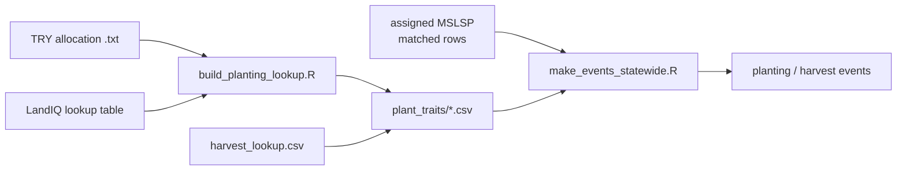

# Planting and harvest lookup builders

Trait-based lookup tables initialize **carbon/nitrogen pools at planting** and
**harvest removal fractions**. They feed [`make_events_statewide.R`](../events/make_events_statewide.R)
via `pool_calculations_from_lookup.R` - planting uses matched MSLSP EVI for LAI;
harvest uses PFT-specific removal rules. Young woody (`YP` / `SPECOND=Y`) is excluded
from planting and harvest events (phenology only); see [`../events/README.md`](../events/README.md).



**Pipeline position:** Session 2 one-time trait build
([documentation/sessions/02-phenology.md](../documentation/sessions/02-phenology.md);
[documentation/pipeline.md](../documentation/pipeline.md)), after LandIQ-MSLSP
match, before statewide planting/harvest events.

**TRY species matching:** only `AccSpeciesName` values listed in LandIQ
`latin_names` (no genus fallback). Pool fallback for planting:
**TRY subclass -> TRY class -> lit subclass -> lit class -> TRY PFT -> default PFT**.
Harvest: **subclass -> class -> pft**, keyed by **PFT + `destructive`**. Defaults
are programmatic `source=default` rows (pool does not invent numbers). Both use
the **2021** LandIQ legend only. Agricultural parcels:
`is_agricultural == TRUE` in the LandIQ lookup table.

Orchard clearing is **not** a separate PFT: use `PFT=woody` and
`destructive=TRUE` on the harvest lookup / event.

---

## Prerequisites

Source the training env once (Session 0):

```bash
source "$CCMMF_CODE/documentation/setup_env.sh"
```

Required R packages: `dplyr`, `readr`, `tibble`, `tidyr`, `data.table` (conda
`pecan-all` provides these).

### Input data (under `$MANAGEMENT`)

| What | Path |
|------|------|
| LandIQ crop code lookup | `LandIQ_cropCode_lookup_table.csv` |
| TRY allocation releases (planting) | `plant_traits/TRY_allocation_traits/*.txt` |
| Planting literature rows | `plant_traits/planting_sources/literature_allocation_traits.csv` |
| Harvest fractions long | `plant_traits/harvest_sources/harvest_fractions_long.csv` |

The LandIQ lookup must have columns: `PFT`, `CLASS`, `SUBCLASS`, `CLASS_desc`,
`SUBCLASS_desc`, `is_agricultural`, plus `latin_names` for TRY species matching.

---

## Step 1 - Build the planting lookup (run once)

```bash
Rscript "$CCMMF_CODE/traits/build_planting_lookup.R"
Rscript "$CCMMF_CODE/traits/build_harvest_lookup.R"
```

Harvest rem/lit: `plant_traits/harvest_lookup.csv` (2021 only; levels
subclass/class/pft; `source` = ludemann|holos|swat|ipcc|literature|default;
column `destructive` FALSE/TRUE).

Inputs: `plant_traits/harvest_sources/harvest_fractions_long.csv` (+ in-script
PFT defaults). Optional rebuild of the long file:
`write_harvest_fractions_long.R`.

**Outputs** (in `$MANAGEMENT/plant_traits/`):

| File | Description |
|------|-------------|
| `planting_lookup.csv` | Planting traits at subclass/class/pft (`try`\|`literature`\|`default`) |
| `harvest_lookup.csv` | Rem/lit lookup including woody clearing rows (`destructive=TRUE`) |

---

## Step 2 - Use pool calculations

Used by [`make_events_statewide.R`](../events/make_events_statewide.R) for statewide
runs. For ad-hoc single-parcel tests, source the pool script directly:

```r
source(file.path(Sys.getenv("CCMMF_CODE"), "traits/pool_calculations_from_lookup.R"))
lk <- load_trait_lookup()
```

### Initialize planting (C/N pools at planting)

Use **`initialize_planting()`** only: pass either a finite **`LAI`** or both **`mslsp_EVImax`** and **`mslsp_EVIamp`**, plus LandIQ **`code`** or both **`class`** and **`subclass`**.

Fixed LAI:

```r
planting <- initialize_planting(
  ID = 100001, DATE = "2018-05-15", PFT = "row", lk = lk,
  code = "T19", LAI = 2.5,
  diagnostics = TRUE
)
```

LAI from matched MSLSP (recommended for statewide event generation):

```r
planting <- initialize_planting(
  ID = 100001, DATE = "2018-05-15", PFT = "row", lk = lk,
  code = "T19",
  mslsp_EVImax = 0.44, mslsp_EVIamp = 0.30,
  diagnostics = TRUE
)
```

`mslsp_EVImax` / `mslsp_EVIamp` come from the phenology product; **LandIQ CLASS** (e.g. YP vs V) is not an MSLSP field. If you omit `class`/`subclass`, **CLASS** is taken from `code` via `lk$mapping` before calling `compute_lai_from_mslsp()`. Only **CLASS** (not SUBCLASS) affects LAI rules today; see the header in `lai_from_mslsp.R`.

### LAI model defaults and swapping coefficients

LAI logic lives in `scripts/traits/lai_from_mslsp.R` (loaded by the pool script). To call it alone:

```r
source(file.path(Sys.getenv("CCMMF_CODE"), "traits/lai_from_mslsp.R"))
lai <- compute_lai_from_mslsp(mslsp_EVImax, mslsp_EVIamp, pft = "row", class = "T")
```

Default formula (Mourad et al. 2020):

`LAI = (max(0, a * sqrt(k * EVI) - b))^2`

Default rule behavior:

- `row` / `rice`: use `EVIamp`, `k = 0.15` (planting-stage LAI ~15% of peak EVI
  amplitude -- pool initialization only; **not** a separate date detector;
  planting **dates** come from MSLSP **OGI**, which is itself ~15% of peak)
- `woody` with `CLASS == "YP"`: use `EVIamp`, `k = 0.50` (leaf-on / 50PCGI scale)
- other `woody`: use `EVImax`, `k = 0.50`
- `hay`: use `EVImax`, `k = 0.50`

Row and rice have a strong bare season, so seasonal amplitude tracks the crop cycle well. Hay and mature woody are often green most of the year; amplitude can be small or noisy while peak EVI still reflects canopy density, so those use `EVImax`. Young perennial woody (`YP`) is still building canopy, so it uses `EVIamp` like the anchor-site workflow.

LAI matching is strict by PFT (with the `YP` CLASS branch for woody). If PFT is missing or unmapped, LAI is `NA`.

To change coefficients or PFT branches, edit `case_when` and constants in `lai_from_mslsp.R`.

### Initialize harvest (removal fractions)

```r
harvest <- initialize_harvest_from_lookup(
  ID       = 100001,
  DATE     = "2018-05-15",
  code     = "T19",
  PFT      = "row",
  lk       = lk,
  destructive = FALSE      # TRUE = orchard clearing (PFT woody only)
)
```

---

## Output columns

### Planting (`initialize_planting` / `planting_pools_from_lookup`)

| Column | Description |
|--------|-------------|
| `LOC`, `DATE` | Parcel ID and planting date |
| `CLASS_SUBCLASS`, `class`, `subclass` | LandIQ crop code and parsed components |
| `crop_desc`, `CLASS_DESC` | Crop descriptions from LandIQ |
| `PFT`, `LAI` | Plant functional type and leaf area index |
| `C_LEAF`, `C_STEM`, `C_FINEROOT`, `C_COARSEROOT` | Carbon pools (kg C m2) |
| `N_LEAF`, `N_STEM`, `N_FINEROOT`, `N_COARSEROOT` | Nitrogen pools (kg N m2) |
| `ENSEMBLE_SIZE` | Set to 1 for deterministic lookups |

Planting C pools use **LAI/SLA** leaf mass, stem from **LWR (110)** and/or **stem fraction (136)** with **RS (9)** / **RMF (470)**, and fine/coarse from **2005/1534** (fractions of whole plant). Units: SLA m2/kg; fractions g/g; leaf N mg/g -> kg/kg via x1e-3; pools kg/m2.

With `diagnostics = TRUE`: `sla_src`, `src_110`, `src_136`, `src_9`, etc. (`src_*` = `subclass`/`class`/`pft`; `source_*` = `try`/`literature`/`default`).

### Harvest (`initialize_harvest_from_lookup`)

| Column | Description |
|--------|-------------|
| `LOC`, `DATE`, `CLASS_SUBCLASS`, `class`, `subclass`, `crop_desc`, `CLASS_DESC`, `PFT` | Same as planting |
| `AGB_REMOVED` | Fraction of aboveground biomass removed at harvest |
| `AGB_LITTER` | Fraction left as litter |
| `BGB_REMOVED` | Fraction of belowground biomass removed |
| `BGB_LITTER` | Fraction of belowground left as litter |
| `destructive` | Logical; clearing uses woody + `TRUE` |
| `ENSEMBLE_SIZE` | Set to 1 |

---

## Quick test

```r
source("scripts/traits/pool_calculations_from_lookup.R")
lk <- load_trait_lookup()
p <- initialize_planting(100001, "2018-05-15", "row", lk, code = "T19", LAI = 2.5)
h <- initialize_harvest_from_lookup(100001, "2018-05-15", "T19", "row", lk)
print(p[, c("C_LEAF", "C_STEM", "N_LEAF")])
print(h[, c("AGB_REMOVED", "BGB_REMOVED")])
```

---

## Script reference

| Script | Purpose |
|--------|---------|
| `build_planting_lookup.R` | TRY + literature + defaults -> `planting_lookup.csv` |
| `write_harvest_fractions_long.R` | Woody lit + HI sources -> `harvest_fractions_long.csv` |
| `build_harvest_lookup.R` | Fractions long + defaults -> `harvest_lookup.csv` |
| `pool_calculations_from_lookup.R` | Load lookups; `initialize_planting()` / `initialize_harvest_from_lookup()` |
| `lai_from_mslsp.R` | LAI from MSLSP EVImax/EVIamp; sourced by pool script |

Active products: `planting_lookup.csv`, `harvest_lookup.csv`. Source tables live
under `planting_sources/` and `harvest_sources/`.

- Event generation: [`../events/README.md`](../events/README.md)
- Matched MSLSP input: [`../phenology/match/README.md`](../phenology/match/README.md)

Planting: **`initialize_planting()`** (public). Internal: **`planting_pools_from_lookup()`** (LandIQ code + numeric LAI -> pools).

---

## Troubleshooting

**"TRY allocation dir not found" / no .txt files**  
Put TRY public dumps under `plant_traits/TRY_allocation_traits/` (or set `TRY_ALLOCATION_DIR`). Expected releases include root/shoot (9), allocation fractions (110/136/...), and organ N / SLA traits.

**"planting_lookup.csv not found"**  
Run `build_planting_lookup.R` (and `build_harvest_lookup.R`) first; products live in `plant_traits/*.csv`.

**"get_group_class_from_code returns NA"**  
The LandIQ code (e.g. `"T19"`) is not in the mapping. Check that `LandIQ_cropCode_lookup_table.csv` includes that CLASS+SUBCLASS and has `is_agricultural == TRUE`.

**Traits fall through to lit, PFT, or default**  
Use `diagnostics = TRUE` and inspect `src_*` (canonical `subclass` / `class` / `pft`) plus `source_*` (`try` / `literature` / `default`). No global fallback; fine/coarse last-resort values are `source=default` rows in the planting lookup.
