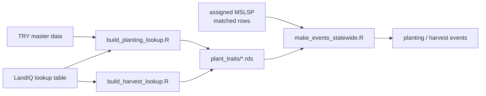

# Planting and harvest lookup builders

Trait-based lookup tables initialize **carbon/nitrogen pools at planting** and
**harvest removal fractions**. They feed [`make_events_statewide.R`](../events/make_events_statewide.R)
via `pool_calculations_from_lookup.R` — planting uses matched MSLSP EVI for LAI;
harvest uses PFT-specific removal rules.



**Pipeline position:** one-time step 7 in [`../hls/README.md`](../hls/README.md#downstream),
after [`../phenology/match/README.md`](../phenology/match/README.md) (step 6), before
[`../events/README.md`](../events/README.md) (step 8).

Both lookups use the same fallback order: **subclass → class → pft → global**.
Agricultural parcels are defined by `is_agricultural == TRUE` in the LandIQ lookup table.

---

## Prerequisites

### Cluster environment

```bash
module load R/4.4.0
```

### Required R packages

- `dplyr`, `readr`, `tibble`, `tidyr` (for build scripts)
- `data.table`, `dplyr`, `readr`, `tibble` (for pool calculations)

If using `renv`, run `renv::restore()`.

### Input data

| What | Path |
|------|------|
| LandIQ crop code lookup | `/projectnb/dietzelab/ccmmf/management/LandIQ_cropCode_lookup_table.csv` |
| TRY master data (planting lookup only) | `/projectnb/dietzelab/mkim/TRYDataR/master_data.RData` |

The LandIQ lookup must have columns: `PFT`, `CLASS`, `SUBCLASS`, `CLASS_desc`, `SUBCLASS_desc`, `is_agricultural`.

---

## Step 1 — Build the lookups (run once)

Build the planting lookup from TRY data (requires `master_data.RData`):

```bash
cd /projectnb/dietzelab/ccmmf/management
Rscript scripts/traits/build_planting_lookup.R
```

Build the harvest lookup (uses LandIQ only; placeholder values):

```bash
Rscript scripts/traits/build_harvest_lookup.R
```

Build a **parallel** harvest lookup from FAOSTAT Excel and/or a PFT summary CSV (does not overwrite `harvest_lookup_long.*`). With Excel, the workflow mirrors **planting**: map each `item` to LandIQ `crop_desc` / subclass, aggregate DRYAD variables at **subclass**, then **class x PFT**, **PFT**, and **global**, compute harvest fractions at each level (mass-balanced AGB = **Y/B** with B = standing/seasonal AGB), then fill every agricultural subclass row with `coalesce(subclass, class, pft, global, placeholder)`. If Excel is missing, the CSV path is still **PFT-only** (legacy summary).

**Woody (V/D/C):** SIPNET applies rem/lit to standing leaf+wood. Until standing AGB exists for vineyards/orchards, those classes stay on the woody **placeholder** (`0.15` / `0.015`). Do not use annual turnover ratios that sum to 1.

```bash
# Uses HARVEST_FAOSTAT_XLSX if present; else HARVEST_PFT_SUMMARY_CSV (defaults under mkim/Harvest Data).
Rscript scripts/traits/build_harvest_lookup_faostat.R
```

Optional env: `HARVEST_FAOSTAT_XLSX`, `HARVEST_PFT_SUMMARY_CSV`, `CCMMF_MANAGEMENT`.

**Outputs** (in `plant_traits/`):

| File | Description |
|------|-------------|
| `planting_lookup_long.rds` | Trait stats at subclass/class/pft/global (RDS) |
| `planting_lookup_long.csv` | Same, CSV for inspection |
| `harvest_lookup_long.rds` | Harvest removal fractions by level (RDS) |
| `harvest_lookup_long.csv` | Same, CSV for inspection |
| `harvest_lookup_long_faostat.rds` | Harvest lookup from FAOSTAT / summary CSV (RDS) |
| `harvest_lookup_long_faostat.csv` | Same, CSV for inspection |

Use the FAOSTAT product in R: `load_trait_lookup(harvest_path = file.path(Sys.getenv("CCMMF_MANAGEMENT"), "plant_traits/harvest_lookup_long_faostat.rds"))`.

---

## Step 2 — Use pool calculations

Used by [`make_events_statewide.R`](../events/make_events_statewide.R) for statewide
runs. For ad-hoc single-parcel tests, source the pool script directly:

```r
source("/projectnb/dietzelab/ccmmf/management/scripts/traits/pool_calculations_from_lookup.R")
lk <- load_trait_lookup()
```

### Initialize planting (C/N pools at planting)

Use **`initialize_planting()`** only: pass either a finite **`LAI`** or both **`mslsp_EVImax`** and **`mslsp_EVIamp`**, plus LandIQ **`code`** or both **`class`** and **`subclass`**.

Fixed LAI:

```r
planting <- initialize_planting(
  ID = 100001, DATE = "2018-05-15", PFT = "row", lk = lk,
  code = "T19", LAI = 2.5,
  diagnostics = TRUE
)
```

LAI from matched MSLSP (recommended for statewide event generation):

```r
planting <- initialize_planting(
  ID = 100001, DATE = "2018-05-15", PFT = "row", lk = lk,
  code = "T19",
  mslsp_EVImax = 0.44, mslsp_EVIamp = 0.30,
  diagnostics = TRUE
)
```

`mslsp_EVImax` / `mslsp_EVIamp` come from the phenology product; **LandIQ CLASS** (e.g. YP vs V) is not an MSLSP field. If you omit `class`/`subclass`, **CLASS** is taken from `code` via `lk$mapping` before calling `compute_lai_from_mslsp()`. Only **CLASS** (not SUBCLASS) affects LAI rules today; see the header in `lai_from_mslsp.R`.

### LAI model defaults and swapping coefficients

LAI logic lives in `scripts/traits/lai_from_mslsp.R` (loaded by the pool script). To call it alone:

```r
source("/projectnb/dietzelab/ccmmf/management/scripts/traits/lai_from_mslsp.R")
lai <- compute_lai_from_mslsp(mslsp_EVImax, mslsp_EVIamp, pft = "row", class = "T")
```

Default formula (Mourad et al. 2020):

`LAI = (max(0, a * sqrt(k * EVI) - b))^2`

Default rule behavior:

- `row` / `rice`: use `EVIamp`, `k = 0.15` (planting stage, ~15% of peak EVI)
- `woody` with `CLASS == "YP"`: use `EVIamp`, `k = 0.50` (leaf-on / 50PGI, ~50% of peak EVI)
- other `woody`: use `EVImax`, `k = 0.50`
- `hay`: use `EVImax`, `k = 0.50`

Row and rice have a strong bare season, so seasonal amplitude tracks the crop cycle well. Hay and mature woody are often green most of the year; amplitude can be small or noisy while peak EVI still reflects canopy density, so those use `EVImax`. Young perennial woody (`YP`) is still building canopy, so it uses `EVIamp` like the anchor-site workflow.

LAI matching is strict by PFT (with the `YP` CLASS branch for woody). If PFT is missing or unmapped, LAI is `NA`.

To change coefficients or PFT branches, edit `case_when` and constants in `lai_from_mslsp.R`.

### Initialize harvest (removal fractions)

```r
harvest <- initialize_harvest_from_lookup(
  ID       = 100001,
  DATE     = "2018-05-15",
  code     = "T19",
  PFT      = "row",
  lk       = lk,
  destructive = FALSE      # TRUE for woody_destructive (e.g. orchard removal)
)
```

---

## Output columns

### Planting (`initialize_planting` / `planting_pools_from_lookup`)

| Column | Description |
|--------|-------------|
| `LOC`, `DATE` | Parcel ID and planting date |
| `CLASS_SUBCLASS`, `class`, `subclass` | LandIQ crop code and parsed components |
| `crop_desc`, `CLASS_DESC` | Crop descriptions from LandIQ |
| `PFT`, `LAI` | Plant functional type and leaf area index |
| `C_LEAF`, `C_STEM`, `C_FINEROOT`, `C_COARSEROOT` | Carbon pools (kg C m⁻²) |
| `N_LEAF`, `N_STEM`, `N_FINEROOT`, `N_COARSEROOT` | Nitrogen pools (kg N m⁻²) |
| `ENSEMBLE_SIZE` | Set to 1 for deterministic lookups |

With `diagnostics = TRUE`: `sla_src`, `sla_n_obs`, `sla_sd_obs`, `src_14`, `src_3441`, etc. (trait source: subclass/class/pft/global).

### Harvest (`initialize_harvest_from_lookup`)

| Column | Description |
|--------|-------------|
| `LOC`, `DATE`, `CLASS_SUBCLASS`, `class`, `subclass`, `crop_desc`, `CLASS_DESC`, `PFT` | Same as planting |
| `AGB_REMOVED` | Fraction of aboveground biomass removed at harvest |
| `AGB_LITTER` | Fraction left as litter |
| `BGB_REMOVED` | Fraction of belowground biomass removed |
| `BGB_LITTER` | Fraction of belowground left as litter |
| `ENSEMBLE_SIZE` | Set to 1 |

---

## Quick test

```r
source("scripts/traits/pool_calculations_from_lookup.R")
lk <- load_trait_lookup()
p <- initialize_planting(100001, "2018-05-15", "row", lk, code = "T19", LAI = 2.5)
h <- initialize_harvest_from_lookup(100001, "2018-05-15", "T19", "row", lk)
print(p[, c("C_LEAF", "C_STEM", "N_LEAF")])
print(h[, c("AGB_REMOVED", "BGB_REMOVED")])
```

---

## Script reference

| Script | Purpose |
|--------|---------|
| `build_planting_lookup.R` | Build planting lookup from TRY + LandIQ (subclass/class/pft/global) |
| `build_harvest_lookup.R` | Build harvest lookup from LandIQ (placeholder means) |
| `build_harvest_lookup_faostat.R` | Optional FAOSTAT-based harvest lookup |
| `pool_calculations_from_lookup.R` | Load lookups; `initialize_planting()` / `initialize_harvest_from_lookup()` |
| `lai_from_mslsp.R` | LAI from MSLSP EVImax/EVIamp; sourced by pool script |

- Event generation: [`../events/README.md`](../events/README.md)
- Matched MSLSP input: [`../phenology/match/README.md`](../phenology/match/README.md)

Planting: **`initialize_planting()`** (public). Internal: **`planting_pools_from_lookup()`** (LandIQ code + numeric LAI → pools).

---

## Troubleshooting

**"Object 'master_data' not found"**  
Run `build_planting_lookup.R` from the management directory. It loads `master_data.RData` from `/projectnb/dietzelab/mkim/TRYDataR/`. Ensure that path exists and contains `master_data`.

**"planting_lookup_long.rds not found"**  
Run `build_planting_lookup.R` first to generate the canonical lookup files in `plant_traits/`.

**"get_group_class_from_code returns NA"**  
The LandIQ code (e.g. `"T19"`) is not in the mapping. Check that `LandIQ_cropCode_lookup_table.csv` includes that CLASS+SUBCLASS and has `is_agricultural == TRUE`.

**All traits fall back to global**  
The crop has no TRY species mapped to its LandIQ `SUBCLASS_desc`. Use `diagnostics = TRUE` to see `sla_src` and `src_*` columns; values like `"global"` indicate fallback.
